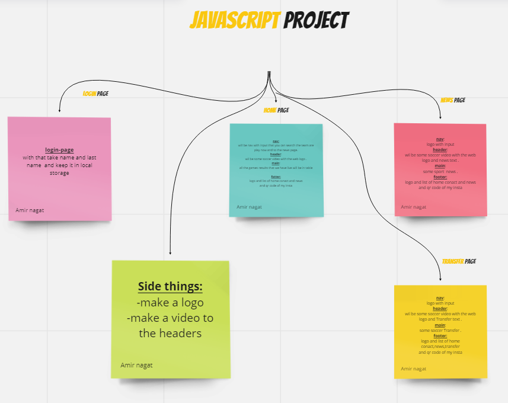
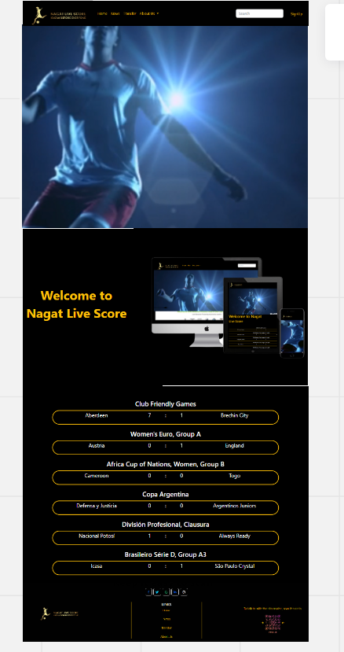
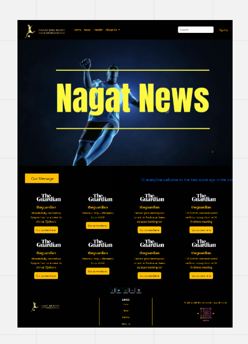
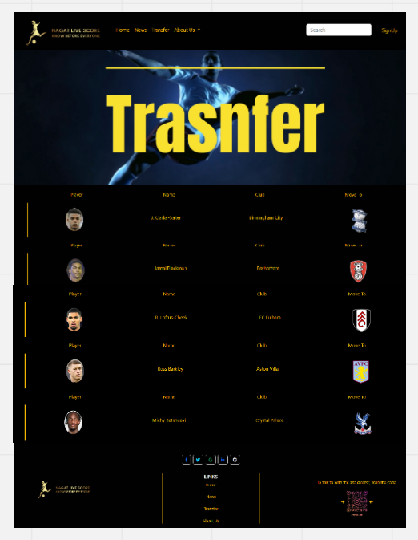
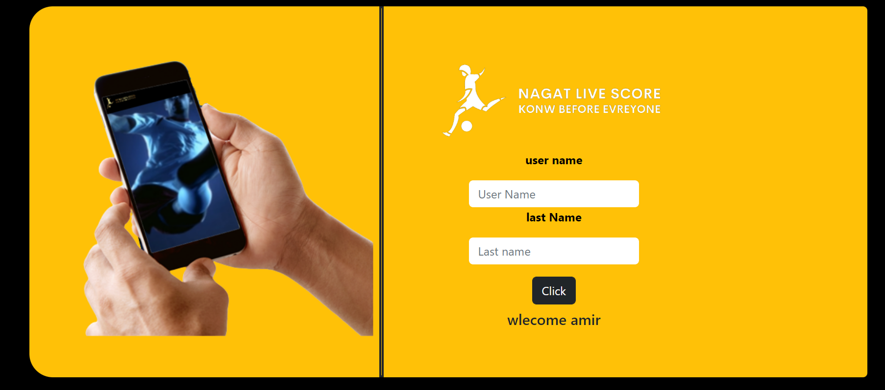

# Live-Score-API-PROJECT
## Description
* A site that presents the results of soccer games from around the world in real time.
With search capability of a specific game. Watch articles from the world of sports and even 
watch transfers of recently transferred players, used with API and, BOOTSTRAP.

## Project Flow
### What was goood:
* the design and making of the code responsive was very enjoyable and fun.

### Difficulties:
* Search good API.
* Making the site that would do functional things was challenging but I succeeded.

## Wareframe & Design
* wareframe
 
* logo
 
* Home Page
 
 * News Page
  
* Transfer Page
  
* Login Page 
  
